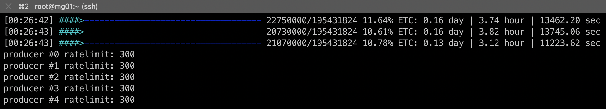

[](https://github.com/Way911/esm/actions/workflows/release.yml)
# esm

```bash
Usage: esm [OPTIONS]

Options:
  -c, --cfg-file-path <CFG_FILE_PATH>  config file path e.g. config.toml [default: config.toml]
  -q, --query-json <QUERY_JSON>        elasticsearch query json e.g. '{"match":{"trading_date":"20251217"}}'
  -h, --help                           Print help
  -V, --version                        Print version
```
